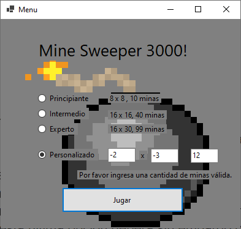
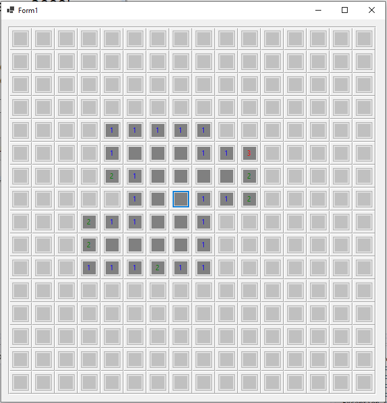
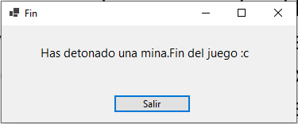
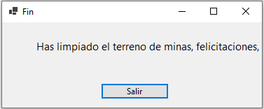

# Manual de usuario


Al abrir la aplicación, aparecerá en pantalla una ventana con varias opciones de dificultad que para ser seleccionadas deberá chulear la opción deseada. La primera llamada principiante consta de una cuadrícula de tamaño 8x8 y 10 minas, la segunda es intermedio y consta de una cuadrícula de 16*16 y 40 minas la tercera es experto y consiste de una cuadrícula de 16*30 celdas y 99 minas, finalmente existe la opción de dificultad personalizada, la cual permite al jugador crear la cuadrícula al tamaño deseado y distribuir en esta la cantidad de minas que se quieran, esta última opción deberá sin embargo cumplir las siguientes condiciones:
* Ambas dimensiones de la cuadrícula deben de ser número enteros positivos.
* La cantidad de minas ingresada debe de ser un número positivo menor a la   cantidad de celdas especificada, es decir, al producto de las dimensiones.

Después de seleccionar una dificultad válida, el jugador deberá presionar el botón jugar que se encuentra en la parte inferior, si la dificultad seleccionada es la personalizada y esta tiene algún problema en sus datos ingresados, aparecerá un letrero advirtiendo al jugador sobre la situación. 





Después de dar click al botón jugar con una opción válida de dificultad, se cerrará esta ventana y aparecerá en pantalla la ventana de juego, la cual consta de una cuadrícula con una cantidad de celdas grises según la dificultad seleccionada en la ventana anterior. 





Estas celdas ocultan un valor que se descubre al ser clickeada, las celdas pueden tomar el valor desde 1 hasta 8 y también pueden ser minas o casillas vacías, los valores numéricos representan la cantidad de minas que están inmediatamente adyacentes a la celda seleccionada, cada valor se representa con un color diferente. Si la casilla resulta estar vacía, entonces, se destaparán las 8 casillas adyacentes a esta y si alguna de estas casillas también resulta estar vacía el proceso se repite, si lo que oculta la casilla seleccionada por el jugador resulta siendo una mina, entonces, se abrirá una ventana de finalización del juego, puesto que se ha detonado una mina y un botón de salida.





El jugador gana la partida si ha descubierto todas las celdas que no contienen minas, al llegar a este punto, se cerrará la ventana actual y se abrirá una ventana de finalización de la partida con un mensaje de victoria y un botón de salida.





# Manual técnico
#### Sistema de archivos 
*nota todas las rutas son relativas a la raíz del proyecto

Los principales y carpetas archivos que componen el proyecto son:

**MineSweeper/Classes/** : en esta carpeta se encuentran los archivos MatrizEnTripleta.cs , NodoDoble.cs y Tripleta.cs que son exactamente iguales a los vistos en la asignatura a excepción de de MatrizEnTripleta.cs donde se agrega dos métodos extras que serán explicado posteriormente.
**MineSweeper/MenuDesigner.cs**:   en este archivo se programa el menú de selección de dificultad.

**MineSweeper/Menu.cs**: en este archivo se crean los eventos relacionados con el control de la ventana creada en MineSweeper/Menu.cs.

**MineSweeper/FinDesigner.cs**:En este archivo se programa la pantalla de fin de juego, ya sea porque se ganó o porque se detonó una mina.
**MineSweeper/Fin.cs**: en este archivo se crean los eventos relacionados con el control de la ventana creada en MineSweeper/Fin.cs.

**MineSweeper/Form1Designer.cs**: En este archivo se crea la pantalla principal de juego y se escribe todo el código relacionado rellenar las celdas con sus correspondientes símbolos (espacios vacíos, números o minas), para este fin  se crean los métodos : 
* Form1
* GenerarBoton
* AsignarNumeros
* Minar
* GenerarTabla

Estos cuatro métodos serán explicados con detalle más adelante.

**MineSweeper/Form1.cs**: En este archivo se programan los eventos relacionados con el control de la ventana creada en MineSweeper/Form1Designer.cs.  El control de estos eventos es de lo más importante en este proyecto, pues es la forma en que el jugador interactúa con el juego, para esto se creó el método Destapar que será explicado con más detalle posteriormente.

**MineSweeper/Program.cs**: En este archivo se inicia la ejecución del programa. Lo único que hace es llamar a MineSweeper/Menu.cs para iniciar el dibujado de ventanas.


### Explicación detallada de los métodos implementados.
El código y métodos que se encuentran en los archivos:
* MineSweeper/MenuDesigner.cs
* MineSweeper/Menu.cs
* MineSweeper/FinDesigner.cs
* MineSweeper/Fin.cs
* MineSweeper/Program.cs

No será explicado en detalle por tratarse de código trivial orientado a crear ventanas.

Por su parte el código y métodos que se encuentran en los archivos:
* MineSweeper/Classes/NodoDoble.cs
* MineSweeper/Classes/Tripleta.cs

No será explicado por ser exactamente igual al desarrollado en el curso Lógica II y Lógica III

### MineSweeper/Classes/MatrizEnTripleta.cs
A parte de lo visto en el curso en este archivo se crean dos métodos que será explicado a continuación.

**Posición**: Este método verifica si las coordenadas de la tripleta ingresada como parámetro ya se encuentran en la matriz dispersa, esto con el fin de evitar de sobreescribir una tripleta o de tener datos repetidos.
```csharp
 public bool posicion(int fila, int columna)
        {
            for (int i = 1; i <= this.retornaNumeroTripletas(); i++)
            {
                if (this.V[i].retornaFila() == fila & this.V[i].retornaColumna() == columna)
                {
                    return true;
                }
            }
            return false;
```


**GenerarCoordenadasAleatorias**: En este método se crea un determinado número de tripletas con coordenadas aleatorias y sin repetir


```csharp
 public void generarCoordenadasAleatorias(int coordenadasAGenerar)
        {
            Random random = new Random();
            int fila;
            int columna;
            int i = 0;
            while(i < coordenadasAGenerar) { 
                fila = random.Next(1, this.retornaNumeroFilas() + 1);
                columna = random.Next(1, this.retornaNumeroColumnas() + 1);
                if(!this.posicion(fila, columna))
                {
                    this.insertaTripleta(new Tripleta(fila, columna, 0));
                    i++;
                }
            }       
        }
```


### MineSweeper/Form1Designer.cs: 
**GenerarBoton**:Este método crea botones con tamaños y colores predefinidos, también se hace uso del atributo “tag” para almacenar el estado del botón, es decir, si este se encuentra actualmente destapado o no, finalmente se suscriben los botones creados al evento “Mouse_Click” que se encarga de la acción al dar click izquierdo sobre el control.

```csharp
private Button GenerarBoton()
        {
            Button cmd = new Button();
            cmd.Size = new System.Drawing.Size(30, 30);
            cmd.Tag = false;
            cmd.ForeColor = System.Drawing.Color.Silver;
            cmd.BackColor = System.Drawing.Color.Silver;
            cmd.Dock = System.Windows.Forms.DockStyle.Fill;
            cmd.MouseClick += new System.Windows.Forms.MouseEventHandler(this.Mouse_Click);
            cmd.Text = "0";
            return cmd;
        }
```


**AsignarNumeros**:Este método recorre todas las celdas de la cuadrícula del juego y al encontrarse con una mina suma uno al valor de las 8 casillas inmediatamente adyacentes a esta.


```csharp
private void AsignarNumeros()
        {
            int fila, columna;
            for (int i = 1; i <= this.numeroDeMinas; i++)
            {
                //En el ciclo anidado siguiente se recorre todas las posibles combinaciones de ((x+i),(y+j))
                //que son las celdas circundantes a minas y se les asigna un valor =+1
                for (int j = -1; j <= 1; j++)
                {
                    for (int k = -1; k <= 1; k++)
                    {
                        //la cuenta en el tablelayout empieza desde 0, por eso se resta una unidad
                        fila = matrizBombas.retornaTripleta(i).retornaFila() - 1;
                        columna = matrizBombas.retornaTripleta(i).retornaColumna() - 1;

                        //la unica excepción posible se da en los bordes de la matriz al intentar acceder a posiciones menores a 
                        //0 ó mayores al número de columnas o filas, esto se controla con este try-catch
                        try
                        {
                            // Recordar que "X" es la forma de representar las minas, por tanto a la celda se le suma una
                            //unidad solo si el valor del texto del boton es diferente de 0

                            Control control = tableLayoutPanel1.GetControlFromPosition(columna + j, fila + k);
                            if (control != null && tableLayoutPanel1.GetControlFromPosition(columna + j, fila + k).Text != "X")
                            {
                                int numeroActual = int.Parse(tableLayoutPanel1.GetControlFromPosition(columna + j, fila + k).Text) + 1;
                                tableLayoutPanel1.GetControlFromPosition(columna + j, fila + k).Text = numeroActual.ToString();
                            }
                        }
                        catch
                        {
                            continue;
                        }
                    }
                }
            }
        }
```


**Minar**:Este método selecciona celdas de la cuadrícula del juego al azar y les pone una mina, esto se repite según la cantidad de minas de la dificultad.


```csharp
public void Minar()
        {
            for (int i = 1; i <= this.matrizBombas.retornaNumeroTripletas(); i++)
            {
                tableLayoutPanel1.GetControlFromPosition(this.matrizBombas.retornaTripleta(i).retornaColumna() - 1, this.matrizBombas.retornaTripleta(i).retornaFila() - 1).Text = "X";
            }
        }
```


**GenerarTabla**:Este método se encarga de crear la cuadrícula de juego según las dimensiones de la dificultad seleccionada.


```csharp
private void GenerarTabla(int columnCount, int rowCount)
        {
            //se limpia el tablelayout que se crea inicialmente con la tabla
            tableLayoutPanel1.Controls.Clear();
            tableLayoutPanel1.ColumnStyles.Clear();
            tableLayoutPanel1.RowStyles.Clear();

            //se establece el número de filas y columnas de acuerdo al tamaño que se haya establecido
            tableLayoutPanel1.ColumnCount = columnCount;
            tableLayoutPanel1.RowCount = rowCount;
            tableLayoutPanel1.AutoScroll = true;

            //Se inserta un botón en las coordenadas deseada
            for (int x = 0; x < columnCount; x++)
            {
                for (int y = 0; y < rowCount; y++)
                {
                    Button cmd = GenerarBoton();
                    tableLayoutPanel1.Controls.Add(cmd, x, y);
                }
            }
        }
```


**Form1**: Es el método constructor tiene como parámetros las dimensiones de la cuadrícula y el número de minas y después de esto se genera la cuadrícula de juego, se ponen las minas en celdas aleatorias y finalmente se asignan los números a las celdas que tienen minas en sus alrededores.


```csharp
public Form1(int numeroFilas, int numeroColumnas, int numeroDeMinas)
        {
            this.numeroFilas = numeroFilas;
            this.numeroColumnas = numeroColumnas;
            this.numeroDeMinas = numeroDeMinas;
            this.casillasPorDestapar = numeroFilas * numeroColumnas - numeroDeMinas;
            this.matrizBombas = new MatrizEnTripleta(new Tripleta(numeroFilas, numeroColumnas, 0));
            this.matrizBombas.generarCoordenadasAleatorias(numeroDeMinas);
            this.InitializeComponent();
            this.GenerarTabla(numeroColumnas, numeroFilas);
            this.Minar();
            this.AsignarNumeros();
        }
```


### MineSweeper/Form1.cs:

**Destapar**: Este método se activa cuando se hace clic en una de las celdas que componen el  tablero, cuando esto sucede se revela el contenido de la celda, este contenido puede ser uno de las tres siguientes clases:
* **La celda es una mina**: Se llama a la pantalla de Game over y  finaliza la ejecución del programa.
* **La celda NO es aledaña a una mina**: se muestra el contenido de la celda (un espacio vacío en este caso) y ejecuta recursivamente el método Destapar() con las celdas vecinas. Cada vez se resta 1 al número de celdas restantes por destapar para ganar.
* **La celda es aledaña a una mina o más**: solamente se muestra el valor de la celda clickeada es decir número, cada número tiene su respectivo color.


```csharp
  private void Destapar(Button button)
        {
 
 
            if (button != null&&!Convert.ToBoolean(button.Tag))
            {
                button.Tag = true;
                TableLayoutPanelCellPosition coordenadas = tableLayoutPanel1.GetCellPosition(button);
                //Caso 1, celda que es una mina
                if (button.Text == "X")
                {
                    Fin fin = new Fin("Has detonado una mina.Fin del juego :c");
                    fin.Show();
                    this.Close();
                    button.Text = "💣";
                    button.ForeColor = System.Drawing.Color.Red;
                    button.BackColor = System.Drawing.Color.Gray;
                } 
 
                //Caso 2, celda que no es aledaña a una mina
                if (button.Text == "0")
                {
                    this.casillasPorDestapar -= 1;
                    button.BackColor = System.Drawing.Color.White;
                    for (int n = -1; n <= 1; n++)
                    {
                        for (int o = -1; o <= 1; o++)
                        { 
                            try
                            {
                                Destapar(tableLayoutPanel1.GetControlFromPosition(coordenadas.Column + n, coordenadas.Row + o) as Button);
                                button.ForeColor = System.Drawing.Color.Gray;
                                button.BackColor = System.Drawing.Color.Gray;
                            }
                            catch
                            {
                                continue;
                            }
                        }
                    }     
                }
 
                //Caso 3, celda que es aledaña a una mina
                else
                {
                    this.casillasPorDestapar -= 1;
 
                    //Cada número posible tiene su respectivo color
                    switch (button.Text)
                    {
                        case "1":
                            button.ForeColor = System.Drawing.Color.Blue;
                            break;
 
                        case "2":
                            button.ForeColor = System.Drawing.Color.Green;
                            break;
 
                        case "3":
                            button.ForeColor = System.Drawing.Color.Red;
                            break;
 
                        case "4":
                            button.ForeColor = System.Drawing.Color.DarkBlue;
                            break;
 
                        case "5":
                            button.ForeColor = System.Drawing.Color.DarkRed;
                            break;
 
                        case "6":
                            button.ForeColor = System.Drawing.Color.DarkCyan;
                            break;
 
                        case "7":
                            button.ForeColor = System.Drawing.Color.Black;
                            break;
 
                        case "8":
                            button.ForeColor = System.Drawing.Color.Orange;
                            break;
 
                    }
                    button.BackColor = System.Drawing.Color.Gray; 
                     
                }  
            }
            if(casillasPorDestapar == 0)
            {
                Fin ganador = new Fin("Has limpiado el terreno de minas, felicitaciones, Ganaste :)");
                ganador.Show();
                this.Close();
            }
        }
```


